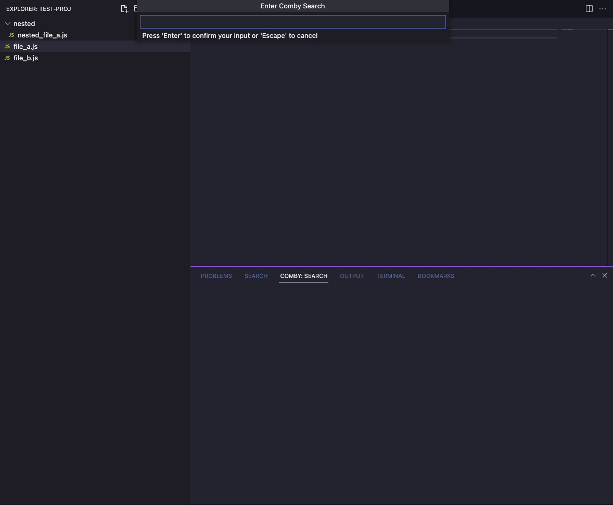

# Comby Search for VSCode

Run [comby](https://comby.dev/) searches from within vscode

## Features

Write comby structural searches and interact with them similar to vscode's default search functionality.

Default language will be chosen based off of the currently open file

## Requirements

The [`comby`](https://comby.dev/) cli must be installed and available in the current path